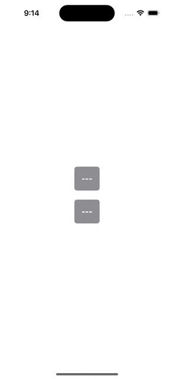

# Simple Count Up/Down example in SwiftUI

This is an attempt to answer the Stackoverflow question [SwiftUI - How to display countdown timer](https://stackoverflow.com/questions/77237979/swiftui-how-to-display-countdown-timer) that makes use of `Date` instead of arbitrarily adding/subtracting a value.

It also makes use of `DateComponentsFormatter` to provide free localisation (rather trying to generate a result by multipling/dividing the counter by second values).

This also takes into consideration the [documented behaviour of `Timer`](https://developer.apple.com/documentation/foundation/timer)

> A timer is not a real-time mechanism. If a timer’s firing time occurs during a long run loop callout or while the run loop is in a mode that isn't monitoring the timer, the timer doesn't fire until the next time the run loop checks the timer. Therefore, the actual time at which a timer fires can be significantly later

